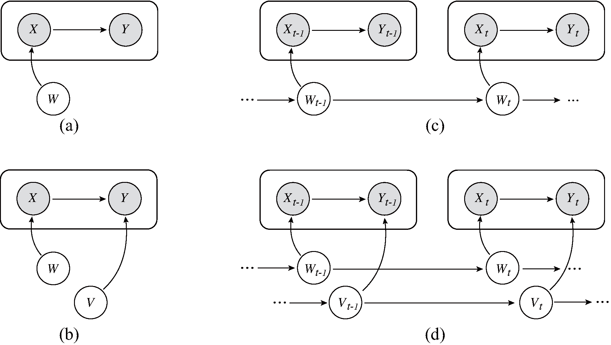
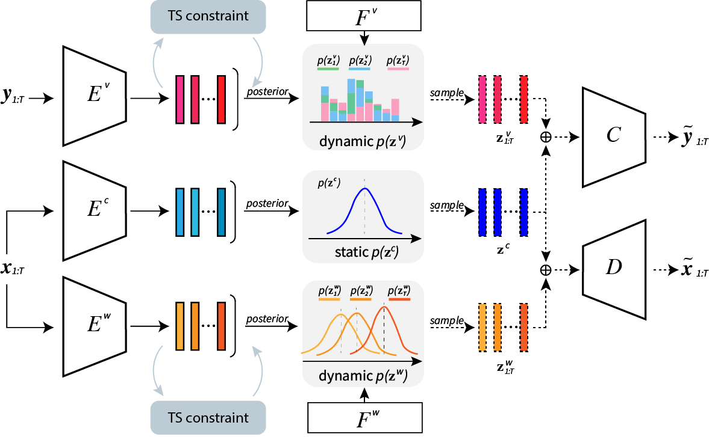
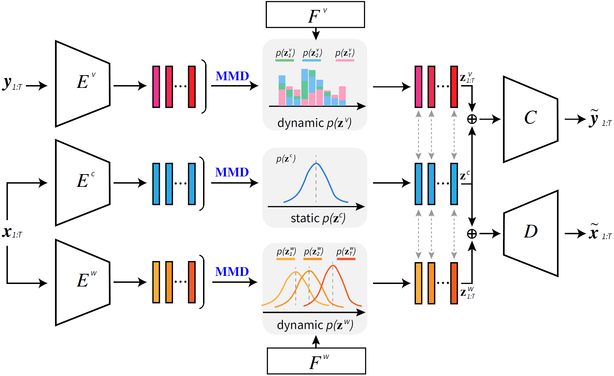

<h2 align="center">
<p> Generalizing to Evolving Domains with Latent Structure-Aware Sequential Autoencoder</p>
</h2>

<div align="center">

[](https://github.com/WonderSeven/LSSAE)
[](https://github.com/WonderSeven/LSSAE)
[](https://github.com/WonderSeven/LSSAE/blob/main/LICENSE)

</div>

---

<p align="center">
    
    <!-- <br>Fig 1. The overview of network architecture for LSSAE.</br> -->
</p>

This repository provides the official implementations and experiments for our research in evolving domian generalization, including [LSSAE](https://proceedings.mlr.press/v162/qin22a/qin22a.pdf) and [MMD-LSAE](https://ieeexplore.ieee.org/abstract/document/10268347). Both of them employ a sequential autoencoder architecture that can be implemented within a same framework, the core codes for implementing these models can be found in [network/vae_algorithms.py](network/vae_algorithms.py). Please follow the [steps](#datasets) below to prepare the datasets, install the required packages, and run the code. 


<!-- This repo contains official PyTorch implementation of:

- [Generalizing to Evolving Domains with Latent Structure-Aware Sequential Autoencoder](https://arxiv.org/abs/2205.07649) (ICML 2022) 
  <br>Tiexin Qin, Shiqi Wang and Haoliang Li.</br>

- [Evolving Domain Generalization Via Latent Structure-Aware Sequential Autoencoder](https://ieeexplore.ieee.org/abstract/document/10268347) (TPAMI 2023) 
  <br>Tiexin Qin, Shiqi Wang and Haoliang Li.</br> -->


<!-- <center>

</center> -->


### LSSAE (ICML 2022)
---

<p align="center">
    
    <br>The network architecture for LSSAE.</br>
</p>

> **Generalizing to Evolving Domains with Latent Structure-Aware Sequential Autoencoder** \
> Tiexin Qin, Shiqi Wang and Haoliang Li\
> Paper: https://proceedings.mlr.press/v162/qin22a/qin22a.pdf

> LSSAE is a VAE-based probabilistic framework which incorporates variational inference to identify the
continuous latent structures of *covariate shift* and *concept shift* in latent space separately and simultaneously for the problem of non-stationary evolving domain generalization.


### MMD-LSAE (TPAMI 2023)
---

<p align="center">
    
    <br>The network architecture for MMD-LSAE.</br>
</p>

> **Evolving Domain Generalization Via Latent Structure-Aware Sequential Autoencoder** \
> Tiexin Qin, Shiqi Wang and Haoliang Li\
> Paper: https://ieeexplore.ieee.org/abstract/document/10268347

> MMD-LSAE is built on LSSAE. Different from LSSAE utilizing KL divergence to align the individual posterior distributions with the corresponding prior distributions for the latent codes, MMD-LSAE aligns aggregated posteriors with the priors via minimizing MMD that can yield a tighter lower bound for optimization, better representation learning and stability. 


### Datasets
- [Circle](https://drive.google.com/file/d/1kWyunwxMXGJI5lARqTuJUFP8_gZ3nFA-/view?usp=sharing)/[Circle-C](https://drive.google.com/file/d/1LM2aWS-d4d47syWROkM57oI2AGZ-hnD2/view?usp=sharing)  [](https://doi.org/10.1007/978-3-319-46227-1_7)
- [Sine](https://drive.google.com/file/d/1E0Z4wxPjQKvWESlZdmt70A6B9SBOXSsw/view?usp=sharing)/[Sine-C](https://drive.google.com/file/d/1l15E_RX9zlvicSYur_Bwdqm7t-LbcKri/view?usp=sharing) [](https://doi.org/10.1007/978-3-319-46227-1_7)
- [RMNIST](http://yann.lecun.com/exdb/mnist/) [](https://doi.org/10.1109/ICCV.2015.293)
- [Portraits](https://drive.google.com/file/d/1nvKn2pwaU6vr7Zmo6DTSts2i5Ik_--DW/view?usp=sharing) [](https://doi.org/10.1109/TCI.2017.2699865)
- [Caltran](https://drive.google.com/file/d/1x-23eDB1ksE2qKDbpA8vwmBRsWD6jiJw/view?usp=sharing) [](https://doi.org/10.1109/CVPR.2014.116)
- [Airline](https://drive.google.com/drive/folders/1NSLLmUUQqtsF8GqaXjrEII-BZ6Rh8BVd?usp=drive_link) [🔗](https://kt.ijs.si/elena_ikonomovska/data.html)
- [ONP](https://drive.google.com/drive/folders/148MHxla5yhrC62VISv0xwXGQkH3TEK7b?usp=drive_link) [](https://doi.org/10.1007/978-3-319-23485-4_53)
- [PowerSupply](https://drive.google.com/file/d/11AXm-kcSWk2LBhaNEMm56UVm7Evhj793/view?usp=sharing) [](https://doi.org/10.1109/JAS.2019.1911747)

We provide the Google Drive links here, so you can download these datasets directly and move them to your own file path for storage.


### Requirements

- python 3.8
- Pytorch 1.10 or above
- Pyyaml
- tqdm

All the required packages can be installed via conda.


### 🚀 Quick Start

#### 1. Toy Circle/-C
```
cd ./LSSAE
chmod +x ./scripts/*

# 1. Specify the path for Circle
    --data_path "/data/Toy_Circle/half-circle.pkl" 

# 2. Run script for LSSAE
./scripts/train_circle_lssae.sh or ./scripts/train_circle_c_lssae.sh

# 2. Run script for MMD-LSAE
./scripts/train_circle_mmd.sh or ./scripts/train_circle_c_mmd.sh
```


#### 2. Other Datasets

To apply our method to other datasets, we can first copy the script of train_circle_*.sh directly, then specify the dataset information and employed network architectures. Here, an example for RMNIST is provided :
```
# 1. Specify the dataset info for RMNIST
    --data_path "/data/DataSets" 
    --num_classes 10 
    --data_size '[1, 28, 28]' 
    --source-domains 10 
    --intermediate-domains 3 
    --target-domains 6 

# 2. Specify the feature extractor and classifier
    --model-func MNIST_CNN
    --cla-func Linear_Cla

# 3. Run script for LSSAE
./scripts/train_rmnist_lssae.sh

# 3. Run script for MMD-LSAE
./scripts/train_rmnist_mmd.sh
```

For different datasets, the feature_extractor (model_func in our implementation), classifier (cla_func in our implementation) and hyper-parameters need to be specified. We provide the detailed description of network architectures and most of the hyper-parameters in our [Appendix](https://arxiv.org/abs/2205.07649). As this is a reproduced version that implements LSSAE and MMD-LSAE into one unified framework, the results could be a little different.  See [./logs](./logs) for running records. 


### Citations  
If you find this repo useful for your research, please cite the following papers:

    @inproceedings{Qin2022LSSAE,
    title={Generalizing to Evolving Domains with Latent Structure-Aware Sequential Autoencoder},
    author={Tiexin Qin and Shiqi Wang and Haoliang Li},
    booktitle={ICML},
    year={2022}
    }

    @article{Qin2023MMDLSAE,
    author={Qin, Tiexin and Wang, Shiqi and Li, Haoliang},
    journal={IEEE Transactions on Pattern Analysis and Machine Intelligence}, 
    title={Evolving Domain Generalization Via Latent Structure-Aware Sequential Autoencoder}, 
    year={2023},
    pages={1-14},
    doi={10.1109/TPAMI.2023.3319984}
    }

---

### Acknowledgments

Our codes are influenced by the following repos: [DomainBed](https://github.com/facebookresearch/DomainBed) and [Disentangled Sequential Autoencoder](https://github.com/yatindandi/Disentangled-Sequential-Autoencoder).
